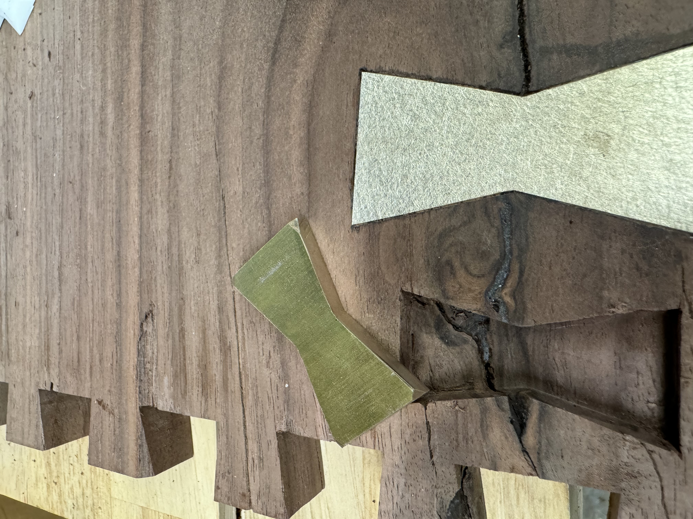

# Mile High Precision Woodworking

# Introduction 

Thank you for purchasing the Mile High Precision Woodworking system to create and install bowtie inlays.
We believe this system is the simplest, fastest, safest and most prceise way to cut bowtie inlays.

Please do not hesitate to reach out to us at milehighprecisionwoodworking@gmail.com with any questions or feedback.
We are always looking for opportunities to improve and have a list of modifications and new product configurations we believe may be of use to some users.

# Instructions

If you have a paper copy of these instructions, please visit bit.ly/milehighprecisionwoodworking to make sure you have the most up-to-date version.

## Required Tools and Materials

To properly use the bowtie inlay system, you will need the following tools:

* A tablesaw with a suitable blade. The blade will need to be able to   extend at least 2.5" above the table top when tilted 14 degrees. A 10" blade works well. If you are cutting brass inlays, make sure you get a blade rated for non-ferrous metal. There are many good options available on Amazon or through woodworking stores.

[This is the blade I use. ](https://www.amazon.com/gp/product/B09RZMZMVB/?th=1)

Note: If you are using a SawStop table saw with flesh-sensing technology, you will need to disable the sensor to cut metal. Refer to the table saw manufacturer's instructions. After cutting metal, it is a good idea to thoroughly clean the blade and surrounding area so that no remaining metal scraps trigger the saw blade when you return to normal use.

* A router equipped with a 7/16" guide bushing. Make sure the baseplate has a hole pattern that will fit your router. There are many good options available on Amazon or through woodworking stores.

[Here is the router base plate and bushings I use](https://www.amazon.com/Milescraft-1201-Plate-Bushing-Routers/dp/B001JEOMN2/)

Note: For maxiumum accuracy, select the guide bushing with the tallest collar that is less than the thickness of the routing template (5/8").

* A 5/16" straight router bit. The cutting depth of the router bit must be at least the thickness of the routing template (5/8") plus the thickness of the inlay (1/4"), so at least 7/8".

* Inlay material. The system is designed to make bowties 1/4" thick. Do not attempt to use the system to cut bowties of different thickness. If you want to try different thicknesses, please contact us to purchase jigs specifically designed for that thickness.

[Here is the 1/4" x 2" x 12" brass stock is use](https://www.amazon.com/dp/B01F80VXJS?th=1)

* A 1/8" allen wrench to adjust the set screws holding the blanks in the jigs. Please be very careful not to over-tighten the set screws; this will crack the jigs. The set screws should only be tight enough to hold the blanks in place during cutting. Very little pressure is needed.

* A chisel to square up the rounded corners of the recesses left by the router. Note: it can be difficult to completely clean up the bottom of the recessess in the tight corners. You may find it easier, as I do, to file off the bottom corners of the inlays so that they can be pressed fully into the recesses.

* Epoxy to glue the inlays in place.

* A carpenter's square, straight-edge or 1x2x3 gauge block to precisely set the height of the saw blade.

[This is the guage block I use](https://www.amazon.com/WEN-10423-1-Inch-Steel-Hardened-Precision/dp/B0000AY61E/)

## Procedure

Ensure all parts of the system are in good working order.

### Step 1: Cutting the rectangular blanks

Three different sizes of bowties can be created using this system. Each size requires the jig specifically designed for that size. The carriage and routing template work for all three sizes.

|Size | Length | Finished Width (top and bottom) | Finished Width at Waist | Recommended Width of Blank |
| ----- | ----- | ----- | ----- | ----- |
| Small | 1+11/16" | 0.86" | 7/16" | 15/16" |
| Medium | 2+3/4" | 1.57" | 0.887" | 1+5/8" |
| Large | 3+7/8" | 1+31/32 | 1" | 2" |

1. Cut the rectangular blanks on the table saw with the blade at 90 degrees. 

Note: cut the length as precisely as possible. The width should be greater than or equal to the specified recommended width.

### Step 2: Cutting the bowties

All three sizes are cut with the blade at the same height and angle and the fence at the same position. If you are making bowties of different sizes, it is convenient to cut all the blanks first and then cut all the bowties without needing to adjust the blade or fence.

Do not attempt to use the jigs without the carriage.

1. Load the blanks into the jig and gently tighten the set screws until they are just snug. 

**Do not over-tighten. This will crack the jig!**

1. Make sure all four corners of the blank extend beyond the jig. They will be trimmed flush.

<figure>

<figcaption>Place up to four rectangular blanks in the slots and very gently tighten the set screws until they are just snug. Make sure the corners stick out beyond the jig just a little.</figcaption>
</figure>

1. Set the table saw fence on the side that the blade tilts at exactly 5" from the near side of the saw blade.

1. Tilt the saw blade 14 degrees towards the fence. The front and back ends of the carriage can be used for alignment. The blade should be exactly parallel to the sloped surface and nearly touching.

1. Place the carriage on the table saw, against the fence and slide it against the blade. It should fit exactly against the fence and the tilted blade. 

1. Place the carpenter's square or 1x2x3 block on the ledge of the carriage and raise the saw blade until the block just barely slides over the saw blade.
<figure>

<figcaption>Set the 1x2x3 block or carpenter's square on the ledge and raise the blade so it just barely touches the block.</figcaption>
</figure>

1. Slide the jig with blanks into the carraige from above. Press down firmly to ensure the bottom of the jig is flush with the bottom of the carriage. The tops should also be flush.

1. Ensure that all of the set screws are below the surface of the jig so that they will not touch the tablesaw.

<figure>

<figcaption>Ensure the jig fits into the carriage flush to the top and bottom surface and that the set screws to not extend out of the jig</figcaption>
<figure>

1. Holding the carriage firmly against the fence, turn on the saw and make the first cuts throug the blanks.

1. Do not remove the jig from the carriage. Flip the entire carriage upside down and position it against the fence. Ensure the top and bottom of the jig are flush with the carriage. 

1. Holding the carriage firmly against the fence, make the second cut. 

1. Before moving to the third cut, ensure the blanks are cut flush to the jig at the corners and waist and that there is no burr at the waist. If the corners stick out beyond the jig, move the fence a microscopic amount towards the fence. If there is a burr at the waist, raise the blade a microscpic amound and repeat cuts 1 and 2.

1. When you are satisfied with the accuracy of the cuts, remove the jig crom the carriage and rotate 180 degrees and reinsert into the carriage.

1. Ensure the top and obottom of the jig are flush to the carriage. 

1. Make the thrid cut.

1. Flip the carriage and jig upside down and make the fourth cut.

1. Before removing the bowties from the jig, ensure that all four corners and the waist are cut flush to the jig. If not, make any adjustments to the blade and fence and repeate all four cuts.

1. If you are creating multiple sizes of bowties, cut them all at the same time without adjusting the blade or fence.

### Step 3: Routing out the recesses

1. Install the baseplate and/or bushing on the router. Use a router bit that is 1/8" smaller diameter than the outer diameter of the bushing. Recommended router bit is 5/16" and bushing is 7/16" OD. 

Note: If using the small bowtie size, the maximum bushing outer diameter is 7/16"

1. Position the router template over the crack or defect where the bowtie inlay is to be installed. The triangular cut-outs on the template can be used to align the center of the bowties to pencil lines.

1. Securely tape the routing template to the work using the tabs around the perimeter. Do not use double-sided tape between the template and work.
<figure>

<figcaption>Use the tabs around the edges to securely tape the routing template to the work. You can see here I have already installed one brass inlay on this crack</figcaption>
</figure>

1. Place the router bit in the recess for the bowtie and lower the bit until it just touches the surface of the work.

1. Place the bowtie on the router depth stop plate, lower the sliding stop bar until it touches the top of the bowtie and tighten the stop bar. This sets the depth of cut to the thickness of the bowtie. Remove the bowtie.

1. Turn on the router, lower the router bit about 1/16" and route out the first pass completely around the perimeter and the center of the bowtie.

1. Lowering the bit about 1/16" each time, continue routing out the recess until the stop bar is in contact with the stop plate.

1. Before removing the template, blow out any sawdust and inspect the recess to make sure it has been fully routed.

### Step 4: Final Installation

1. Remove the template from the work.

1. Using a hand chisel, carefully square up the four corners of the recess and clean out any wood chips.

1. It may be difficult to fully clean out the bottoms of the tight corners. It may be is easier to file off the underside of the bowtie corners to ensure it will fit fully into the recess.
<figure>

<figcaption>Notice the corners of the bow tie have been very slightly filed down. This allows it to fit fully into the recess, even if the tight corners are not fully cleared.</figcaption>
</figure>

1. Test the fit as best as possible. You may need to adjust the fit by filing or sanding the edges of the bowtie, or using a chisel to shave the sides of the recess.

1. When you are happy with the fit, mix the epoxy in the recess and firmly press or clamp the inlay in place.

1. After the expoy has dried, sand the surface flush using 60-grit sandpaper before moving on to finer grits.

### Step 5: Enjoy your work and share your results and feedback

1. We hope you have enjoyed this process and are satisfied with the results. Please send any pictures, comments or suggestions to us at milehighprecisionwoodworking@gmail.com. Please tell us if it's okay to include your images on our site.

